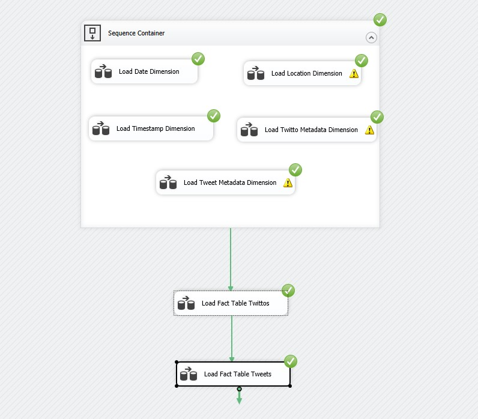
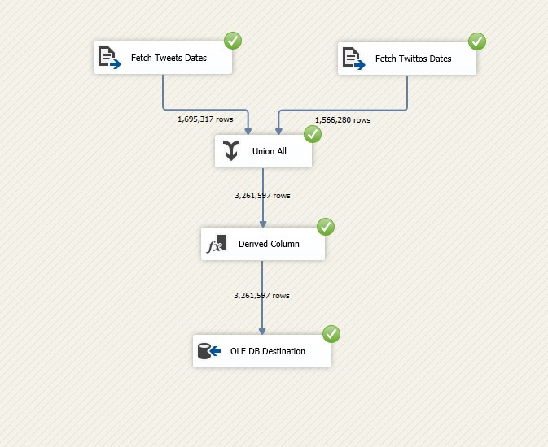
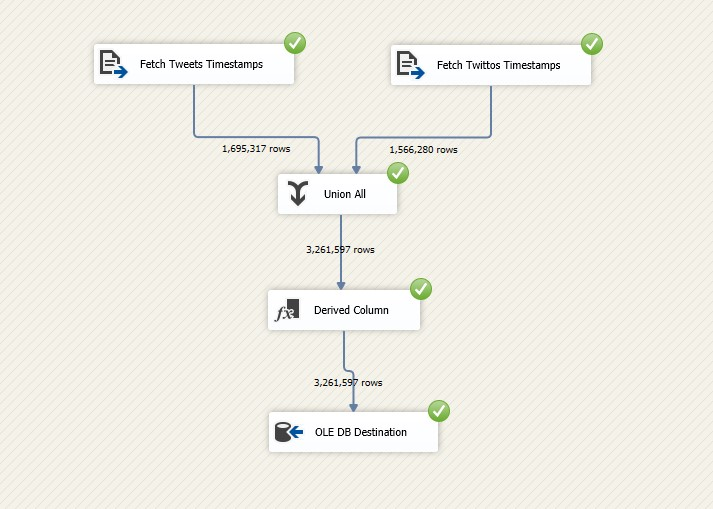
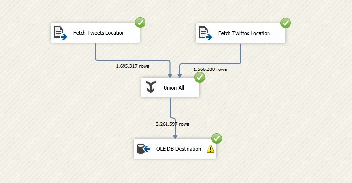
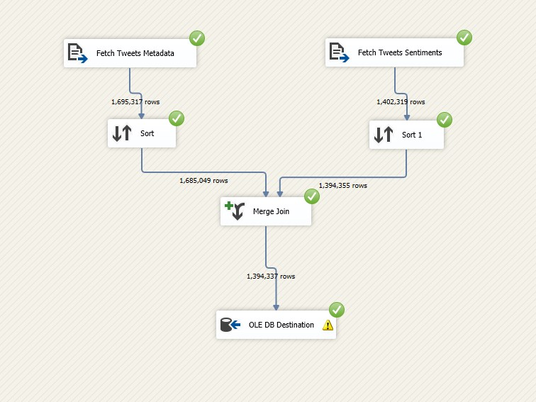
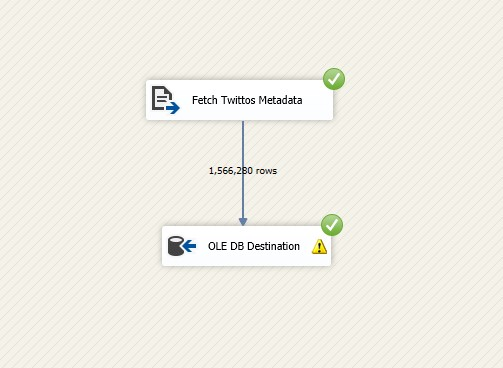
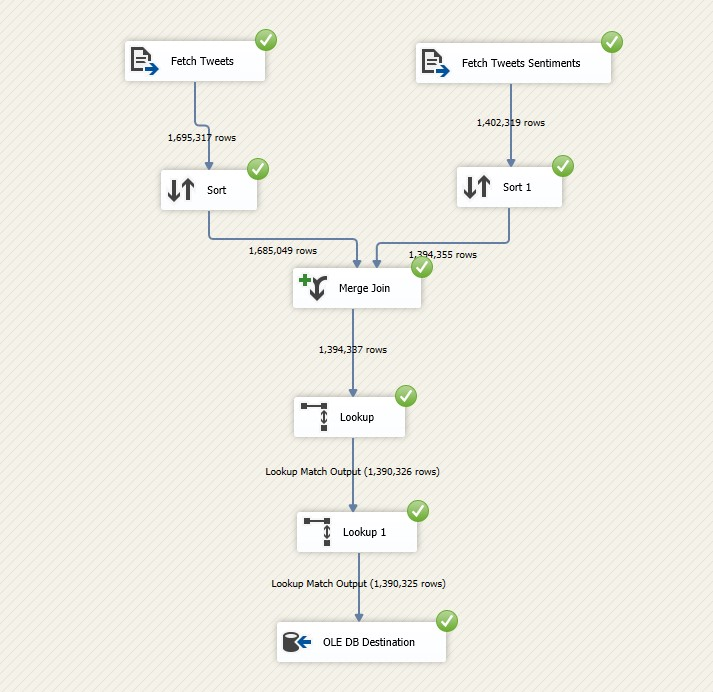
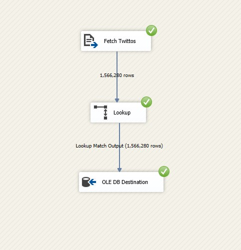

#tweetDataWarehouse: A Comprehensive Social Media Data Storage and Analysis Project

## Twitter DataTypes :

### TweetDataType :

```json
{
   "created_at":"Sat Jul 01 23:47:16 +0000 2017",
   "id":881298189072072708,
   "id_str":"881298189072072708",
   "text":"Your profile was viewed by 5 people in the last week. \u00 last 4 hours https:\/\/t.co\/cKb35CahC7",
   "source":"\u003ca href=\"http:\/\/www.twitcom.com.br\" rel=\"nofollow\"\u003 eTwitcom - Communities \u003c\/a\u003e",
   "truncated":false,
   "in_reply_to_status_id":null,
   "in_reply_to_status_id_str":null,
   "in_reply_to_user_id":null,
   "in_reply_to_user_id_str":null,
   "in_reply_to_screen_name":null,
   "user": UserDataType,
   "geo":null,
   "coordinates":null,
   "place":null,
   "contributors":null,
   "is_quote_status":false,
   "retweet_count":0,
   "favorite_count":0,
   "entities":{
      "hashtags":[

      ],
      "urls":[
         {
            "url":"https:\/\/t.co\/cKb35CahC7",
            "expanded_url":"http:\/\/twcm.me\/5bHmW",
            "display_url":"twcm.me\/5bHmW",
            "indices":[
               55,
               78
            ]
         }
      ],
      "user_mentions":[

      ],
      "symbols":[

      ]
   },
   "favorited":false,
   "retweeted":false,
   "possibly_sensitive":false,
   "filter_level":"low",
   "lang":"pt",
   "timestamp_ms":"1498952836660"
}
```

### UserDataType :

```json
{
   "id":2696402179,
   "id_str":"2696402179",
   "name":"$AVAGE",
   "screen_name":"SavageHumor",
   "location":null,
   "url":null,
   "description":"SAVAGE TWEETS \nWARNING: 18+ Content",
   "protected":false,
   "verified":false,
   "followers_count":150201,
   "friends_count":0,
   "listed_count":94,
   "favourites_count":85,
   "statuses_count":10696,
   "created_at":"Thu Jul 31 18:52:37 +0000 2014",
   "utc_offset":-18000,
   "time_zone":"Central Time (US & Canada)",
   "geo_enabled":false,
   "lang":"en",
   "contributors_enabled":false,
   "is_translator":false,
   "profile_background_color":"000000",
   "profile_background_image_url":"http:\/\/abs.twimg.com\/images\/themes\/theme1\/bg.png",
   "profile_background_image_url_https":"https:\/\/abs.twimg.com\/images\/themes\/theme1\/bg.png",
   "profile_background_tile":false,
   "profile_link_color":"DD2E44",
   "profile_sidebar_border_color":"000000",
   "profile_sidebar_fill_color":"000000",
   "profile_text_color":"000000",
   "profile_use_background_image":false,
   "profile_image_url":"http:\/\/pbs.twimg.com\/profile_images\/875059551204249601\/J_XlKaiO_normal.jpg",
   "profile_image_url_https":"https:\/\/pbs.twimg.com\/profile_images\/875059551204249601\/J_XlKaiO_normal.jpg",
   "profile_banner_url":"https:\/\/pbs.twimg.com\/profile_banners\/2696402179\/1416368695",
   "default_profile":false,
   "default_profile_image":false,
   "following":null,
   "follow_request_sent":null,
   "notifications":null
}
```

## 1- ETL Pipeline:

### a) Extraction:

The first step is to prepare the **tweetsPOOLs.csv** file as shown here: [tweetsPOOLs.csv](https://github.com/MohamedHmini/tweetsOLAPing/blob/master/extraction/archivedTweetsCrawler/tweetsPOOLs.csv).

Next, execute the **Scrapy Spider** to crawl the required web pages as follows:

```shell
  cd extraction/archivedTweetsCrawler
  scrapy crawl -o tweetsSTREAMs.csv tweets
```

This will generate a file similar to the one here: [tweetsSTREAMs.csv](https://github.com/MohamedHmini/tweetsOLAPing/blob/master/sample-data/tweetsSTREAMs.csv).

The next step is to structure this CSV file into a tree-like format composed of directories and files:

```shell
  cd extraction/
  python tweetsPOOLsParser.py tweetsSTREAMs.csv ../root_urls/
```

The output will be something like this lightweight example: [urls_root](https://github.com/MohamedHmini/tweetsOLAPing/tree/master/sample-data/urls_root).

Next, perform a random selection to choose only some URLs. Note that each URL can provide up to 5000 tweets:

```shell
  cd extraction/
  python urlsRandomSelector.py ../root_urls/ ../chosen_urls.txt 700
```

Check this link for an output example: [chosen_urls.txt](https://github.com/MohamedHmini/tweetsOLAPing/blob/master/sample-data/chosen_urls.txt).

Once we have all the required URLs in a single file, we can start downloading:

```shell
  cd extraction/
  python tweetsDownloader.py ../chosen_urls.txt ../downloaded_pools/ ../download_error.txt
```

Check this link for an output example: [downloaded-pools](https://github.com/MohamedHmini/tweetsOLAPing/tree/master/sample-data/downloaded-pools).

After downloading, you will notice the files are compressed with a .bz2 extension. You will need to decompress them. I do not provide a solution for this at this stage.

Check this link for an output example: [decompressed-pools](https://github.com/MohamedHmini/tweetsOLAPing/tree/master/sample-data/decompressed-pools).

Note that I provide a script to lookup tweets from the Twitter API directly using the downloaded tweet IDs. Since the tweets have been collected in the stream, most of them have zero metrics. I address this issue using a context-aware random generator.

### b) Transformation:

The transformation stage consists of two parts. First, we convert our data from JSON to CSV and create all the necessary derived attributes. We will also remove duplicate users. Note that the cleanUsersCSV.py script uses multi-threading to speed up I/O operations, and the results will be stored in a directory. You can then merge them as needed.

```shell
  cd transformation/
  python prepareTweets.py ../decompressed_pools/ ../tweets.csv ../twittos.csv ../trans-err.txt
  python cleanUsersCSV.py ../twittos.csv ../twittos
```

The second part involves performing NLP analysis on the tweets to generate sentiment scores and content classification. You need to provide the projectkey.json file from Google NLP API in the same directory.

```shell
  cd transformation/
  python performNLPanalysis.py ../decompressed_pools/ ../tweets_sentiments.csv ../sent-err.txt
```

Check this link for an output example: [processed](https://github.com/MohamedHmini/tweetsOLAPing/tree/master/sample-data/processed).

### c) Loading:

Before starting the SSIS process, you need to provide normalized data in the correct path (this path should be fixed):

```shell
  cd loading/
  python dataNormalization.py ../twittos.csv ../tweets.csv ../data/normalized
```

Check this link for an output example: [normalized-data](https://github.com/MohamedHmini/tweetsOLAPing/tree/master/sample-data/normalized-data).

For SSIS logic, I provide the full model: [tweetsOLAPing_loading](https://github.com/MohamedHmini/tweetsOLAPing/tree/master/loading/tweetsOLAPing_loading).

The SSAS logic is also fully provided: [tweetsOLAPing_analysis](https://github.com/MohamedHmini/tweetsOLAPing/tree/master/analysis/tweetsOLAPing_analysis).

#### SSIS modeling : 

after setting up all the connections ( the normalized data as well as the OLEDB destinations), we now arrive at the integration step or the data loading : 

<p align="center">
  
</p>
<p align="center">
  
</p>
<p align="center">
  
</p>
<p align="center">
  
</p>
<p align="center">
  
</p>
<p align="center">
  
</p>
<p align="center">
  
</p>
<p align="center">
  
</p>
